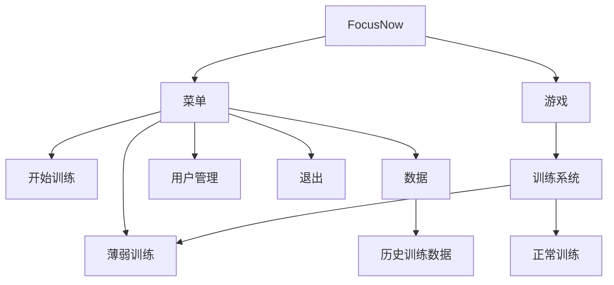
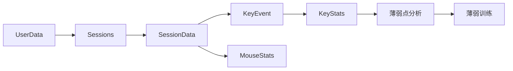

# FocusNow 完成要求（步骤清单）

> 本文件是**独立的完成要求清单**，不动任何源代码。
> 每步完成后逐个向用户确认，确认通过再进入下一步。

## 项目定位

**FocusNow 第一阶段目标 = 单机个人训练系统**，不是单纯小游戏。
核心闭环：`记录 → 分析 → 找弱点 → 针对训练 → 再记录`。



---

## 一、菜单系统（第一版先做简单）

```
开始训练
薄弱训练
数据统计
用户管理
退出
```

启动后**不直接进入训练**，先进菜单。

---

## 二、单机多用户 / 多存档

同一台电脑可建多个训练档案，数据互相独立，核心概念是 **UserData**（一个用户的全部数据）：

```
用户
├── 用户基本信息
├── KeyStats[26]      （A-Z 统计）
├── MouseStats        （注意力统计）
└── Sessions          （历史每次训练）
```

---

## 三、训练数据层级（最终形态）



各结构职责：

| 结构 | 内容 | 代码现状 |
| --- | --- | --- |
| `KeyEvent` | 一次按键：目标、实际、是否正确、反应时间 | ✅ 已存在 |
| `KeyStats` | 某字母：总次数、正确次数、错误次数、正确率、平均反应时间 | ⚠️ 现为 `LetterData`，字段不全 |
| `MouseStats` | 鼠标目标、判断次数、正确次数、正确率、反应时间 | ⚠️ 已存在但字段不全、未填数 |
| `SessionData` | 一次完整训练：训练时间、时长、键盘表现、鼠标表现、A-Z表现 | ❌ 未定义 |
| `UserData` | 用户基本信息 + KeyStats + MouseStats + Sessions | ❌ 未定义 |

---

## 四、薄弱训练 ⭐（特色功能）

普通训练随机生成 `A B C D...`；训练结束后统计各字母正确率，找出最弱字母（如 `B = 75%`），
薄弱训练中提高它的出现频率：

```
普通训练：A B C D A C B D
薄弱训练：B A B C B D B A B C
```

---

## 五、数据统计界面

```
总体正确率     93.5%
平均反应时间   0.42s
最强字母       A   98%
最弱字母       B   76%
鼠标正确率     87%
训练次数       25
累计训练时间   12.5h

A ████████████████████ 98%
B ███████████████      76%
...
```

---

## 六、历史数据

不能只保存当前成绩，要能看趋势：

```
B：68% → 73% → 79% → 86%   （判断训练有没有效果）
```

---

## 七、开发顺序（按依赖关系）

```
① 基础训练       （打字消除 + 随机不重叠）
   ↓
② KeyEvent       （记录每次按键）
   ↓
③ KeyStats       （由 KeyEvent 汇总出每个字母统计）
   ↓
④ MouseStats     （注意力统计）
   ↓
⑤ SessionData    （一次完整训练）
   ↓
⑥ UserData       （用户全部数据）
   ↓
⑦ 文件保存 / 读取
   ↓
⑧ 菜单系统
   ↓
⑨ 数据统计界面
   ↓
⑩ 薄弱点分析
   ↓
⑪ 薄弱训练
```

> ⚠️ **不要同时写菜单、存档、薄弱训练**，严格按上面顺序。

---

## 当前进度盘点

| 步骤 | 内容 | 状态 |
| --- | --- | --- |
| ① | 基础训练 | ✅ 已完成 |
| ② | KeyEvent | ⚠️ 结构已完成，`reactionTime` 仍填 0（真实计时待做） |
| ③ | KeyStats | ⚠️ `LetterData` + `ComputeLetterStats` 已写，但字段不全、未接线调用 |
| ④ | MouseStats | ❌ 未填数 |
| ⑤ | SessionData | ❌ 未定义 |
| ⑥ | UserData | ❌ 未定义 |
| ⑦ | 文件保存/读取 | ❌ 未实现 |
| ⑧ | 菜单系统 | ❌ 未实现 |
| ⑨ | 数据统计界面 | ❌ 未实现 |
| ⑩ | 薄弱点分析 | ❌ 未实现 |
| ⑪ | 薄弱训练 | ❌ 未实现 |

---

## 第一小目标：KeyEvent → KeyStats

先把数据管道最核心的一段打通。

**KeyEvent**（已存在，保持不变）：
```cpp
struct KeyEvent {
    char expected;      // 目标字母
    char actual;        // 实际按键
    double reactionTime;// 反应时间（真实计时后补）
    bool correct;       // 是否按对
};
```

**KeyStats**（现 `LetterData` 需要补全）：
```cpp
struct KeyStats {
    int totalCount = 0;    // 总次数
    int correctCount = 0;  // 正确次数
    // 可推导：错误次数 = total - correct
    // 可推导：正确率   = correct / total
    // 可推导：平均反应时间 = totalTime / total
    double totalTime = 0.0; // 总反应时间
};
```

待补项：
1. `ComputeLetterStats` 中补出**错误次数、正确率、平均反应时间**（或提供计算方式）。
2. 在**结算处真正调用** `ComputeLetterStats`（目前没有任何地方调用它）。

---

## 执行约定

1. 严格**只改当前步骤涉及的代码**，其余源代码保持不动。
2. 每完成一步，**停下向用户汇报结果，等用户确认**后再进行下一步。
3. 按 ①→⑪ 顺序推进，当前从 **③ KeyStats（补全 + 接线）** 开始。
